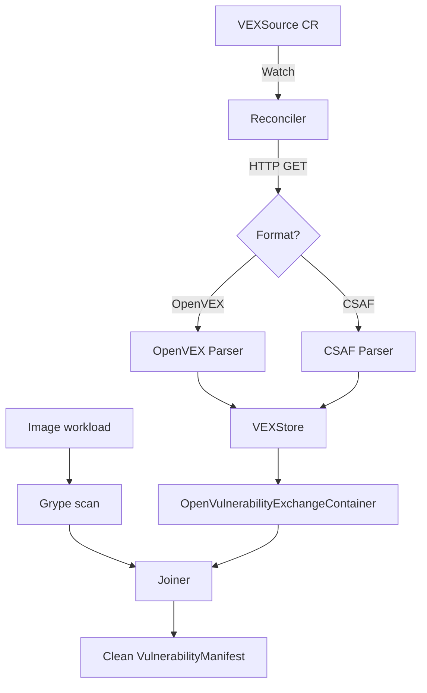

# VEXBridge Architecture & Design Document

## 1. Overview
VEXBridge is a Kubernetes controller designed to ingest external VEX (Vulnerability Exchange) feeds—specifically in OpenVEX and CSAF VEX profiles—and correlate vendor vulnerability assertions with scan findings produced by vulnerability scanners (such as Grype) within the Kubescape ecosystem.

## 2. Component Architecture

### 2.1 Reconciler (`internal/controller`)
- Watches `VEXSource` resources.
- Periodically fetches feed documents via `HTTPClient` using `ETag` conditional headers and SHA-256 digests.
- Updates status subresources with statement counts, feed hashes, and standard Kubernetes conditions (`Type: Synced`).

### 2.2 Parsers (`internal/fetcher`)
- **OpenVEX Parser**: Normalizes OpenVEX JSON-LD documents.
- **CSAF Parser**: Normalizes CSAF VEX profile JSON documents (`known_not_affected` and `fixed` product statuses).

### 2.3 Store & State Isolation (`internal/store`)
- Thread-safe, keyed in-memory store indexed by `(VulnID, Product)`.
- Deduplicates statements across feeds with last-writer-wins semantics.
- Supports `Reset()` to prevent stale feed entries from persisting across reconcile iterations.

### 2.4 Joiner (`internal/joiner`)
- Matches raw scanner findings against stored VEX statements.
- Marks findings matching `not_affected` or `fixed` vendor statements as `Suppressed`.
- Preserves full provenance (`SuppressedBy`) including feed source URL and statement ID.
