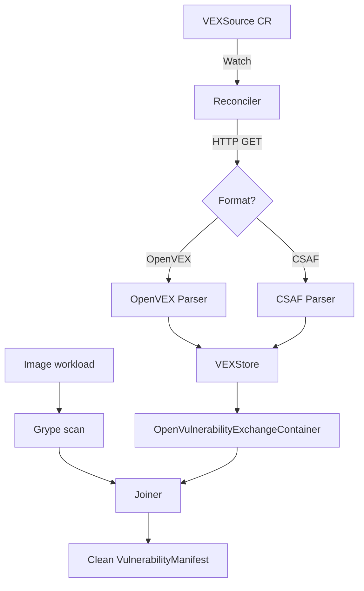

# VEXBridge

Kubernetes controller for ingesting external OpenVEX and CSAF feeds into the Kubescape vulnerability pipeline.

[](https://goreportcard.com/report/github.com/AdeshDeshmukh/vexbridge)
[](LICENSE)

## What It Does

Kubescape's `kubevuln` produces VEX documents from its own scan results but does not consume VEX published by image vendors. Distribution base images (`nginx`, `alpine`, `python`, `RHEL UBI`) account for the majority of CVE findings in most clusters — vendors have already triaged most as `not_affected` or `fixed`.

VEXBridge closes this gap: it introduces a `VEXSource` CRD, a controller that periodically fetches and normalises external feeds, and a join step that suppresses vendor-resolved findings before they reach the user while preserving complete provenance.

## Architecture



## Quickstart

```bash
# Install CRD
kubectl apply -f config/crd/

# Apply a Red Hat CSAF feed source
kubectl apply -f config/samples/redhat-vex-source.yaml

# Check sync status
kubectl get vexsource -n vexbridge-system
```

## Running Tests

```bash
# Unit + integration with race detection
make test

# End-to-end (requires kind cluster)
make e2e
```

## Relation to Kubescape

VEXBridge reuses the `OpenVulnerabilityExchangeContainer` API shape from [kubevuln](https://github.com/kubescape/kubevuln) and is designed to compose with the SecurityException CRD — vendor `not_affected` statements and user-authored exceptions share the same matching model.

## License

Apache License 2.0 — same as Kubescape itself.
