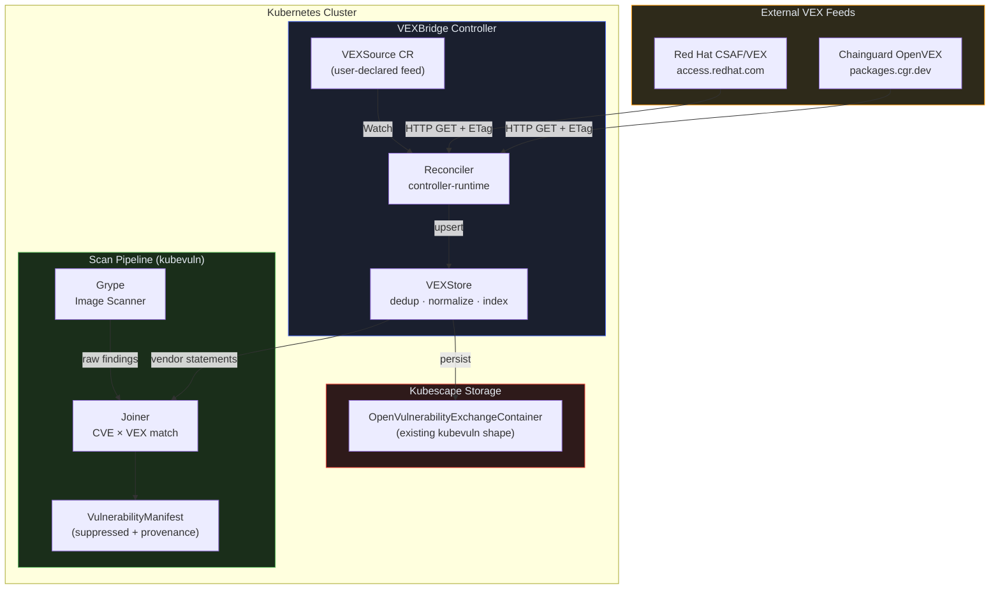
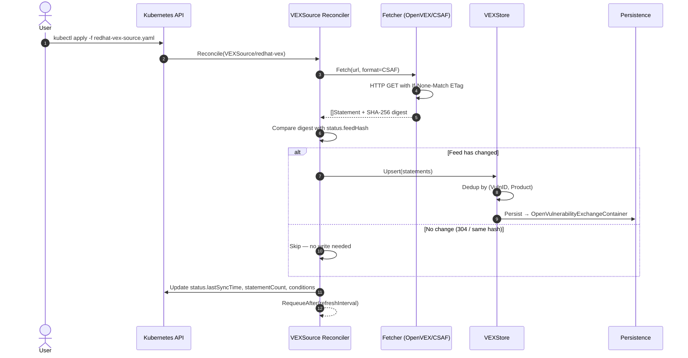
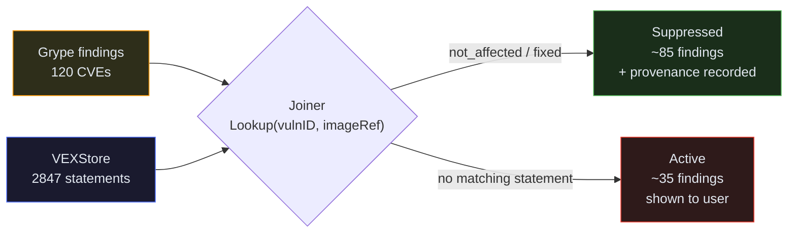

<div align="center">

<br/>

```
██╗   ██╗███████╗██╗  ██╗██████╗ ██████╗ ██╗██████╗  ██████╗ ███████╗
██║   ██║██╔════╝╚██╗██╔╝██╔══██╗██╔══██╗██║██╔══██╗██╔════╝ ██╔════╝
██║   ██║█████╗   ╚███╔╝ ██████╔╝██████╔╝██║██║  ██║██║  ███╗█████╗  
╚██╗ ██╔╝██╔══╝   ██╔██╗ ██╔══██╗██╔══██╗██║██║  ██║██║   ██║██╔══╝  
 ╚████╔╝ ███████╗██╔╝ ██╗██████╔╝██║  ██║██║██████╔╝╚██████╔╝███████╗
  ╚═══╝  ╚══════╝╚═╝  ╚═╝╚═════╝ ╚═╝  ╚═╝╚═╝╚═════╝  ╚═════╝ ╚══════╝
```

**External VEX Ingestion Controller for Kubescape**

*Silence the noise. Surface what matters.*

<br/>

[](https://go.dev)
[](LICENSE)
[](https://kubescape.io)
[](https://pkg.go.dev/sigs.k8s.io/controller-runtime)
[](https://openvex.dev)
[](https://oasis-open.github.io/csaf-documentation/)

<br/>

</div>

---

## The Problem

Kubescape's `kubevuln` component is excellent at *generating* VEX documents from scan results. But it ignores VEX published by the vendors who built your base images — and those vendors have already triaged most of the noise.

> A typical nginx or alpine image scan returns **60–120 CVEs**.  
> Red Hat and Chainguard have already marked **70–85% of them** as `not_affected` or `fixed`.  
> Kubescape currently shows you all of them.

**VEXBridge closes this gap.**

It introduces a `VEXSource` CRD that declares an external feed, a controller that fetches and normalizes that feed on a configurable schedule, and a join step in the scan pipeline that suppresses vendor-resolved findings — with full provenance recorded so you always know *why* a finding was suppressed.

---

## Architecture

### High-Level Flow



### Reconcile Loop (Sequence View)



### Joiner — Finding Suppression



---

## File Structure

```
vexbridge/
│
├── cmd/
│   └── vexbridge/
│       └── main.go                  # Manager bootstrap, signal handling, leader election
│
├── api/
│   └── v1alpha1/
│       ├── vexsource_types.go       # VEXSource CRD — Spec, Status, Conditions
│       ├── vexsource_webhook.go     # Defaulting + validation webhook
│       └── groupversion_info.go     # Group: security.vexbridge.io / Version: v1alpha1
│
├── config/
│   ├── crd/
│   │   └── vexsource.yaml           # Generated CRD manifest (kubebuilder markers)
│   ├── rbac/
│   │   ├── role.yaml                # ClusterRole for VEXSource CRUD + status patch
│   │   └── rolebinding.yaml
│   └── samples/
│       ├── redhat-vex-source.yaml   # Red Hat CSAF/VEX feed
│       └── chainguard-vex-source.yaml
│
├── internal/
│   ├── controller/
│   │   └── vexsource_controller.go  # Reconciler — owns full sync lifecycle
│   │
│   ├── fetcher/
│   │   ├── fetcher.go               # Fetcher interface + HTTPClient (ETag caching)
│   │   ├── openvex.go               # OpenVEX JSON-LD parser → []Statement
│   │   └── csaf.go                  # CSAF VEX profile parser → []Statement
│   │
│   ├── store/
│   │   └── vexstore.go              # Thread-safe (VulnID, Product) → Statement index
│   │
│   ├── joiner/
│   │   └── joiner.go                # Match VEX statements against Grype findings
│   │
│   └── grype/
│       └── runner.go                # Grype CLI invocation wrapper
│
├── test/
│   ├── e2e/
│   │   └── vexsource_e2e_test.go    # kind cluster test against real Red Hat CSAF feed
│   └── fixtures/
│       ├── redhat-CVE-2024-1234.json
│       └── chainguard-sample.openvex.json
│
├── DESIGN.md                        # Architecture decisions and OSS boundary rationale
├── CONTRIBUTING.md                  # Local setup, PR workflow, test guide
├── README.md
├── Makefile
├── Dockerfile
├── go.mod
└── go.sum
```

---

## Quickstart

### Prerequisites

| Tool | Version | Purpose |
|------|---------|---------|
| Go | ≥ 1.22 | Build |
| kubectl | ≥ 1.28 | Cluster interaction |
| kind | ≥ 0.23 | Local cluster for e2e |
| Docker | any | Image build |
| golangci-lint | ≥ 1.59 | Lint |

### 1. Install the CRD

```bash
kubectl apply -f config/crd/vexsource.yaml
```

### 2. Apply a VEX feed source

```yaml
# config/samples/redhat-vex-source.yaml
apiVersion: security.vexbridge.io/v1alpha1
kind: VEXSource
metadata:
  name: redhat-vex
  namespace: vexbridge-system
spec:
  url: "https://access.redhat.com/security/data/csaf/v2/vex/"
  format: CSAF
  imageSelector: "registry.access.redhat.com/*"
  refreshInterval: 6h
```

```bash
kubectl apply -f config/samples/redhat-vex-source.yaml
```

### 3. Check sync status

```bash
kubectl get vexsource -n vexbridge-system

# NAME           FORMAT   LASTSYNC               STATEMENTS
# redhat-vex     CSAF     2026-08-15T10:00:00Z   2847
# chainguard     OpenVEX  2026-08-15T10:01:00Z   312
```

### 4. Inspect a full sync result

```bash
kubectl describe vexsource redhat-vex -n vexbridge-system

# Status:
#   Conditions:
#     Message:    ingested 2847 statements
#     Reason:     FetchSucceeded
#     Status:     True
#     Type:       Synced
#   Feed Hash:    a3f8e1d2b4c6...
#   Statement Count: 2847
```

---

## VEXSource CRD Reference

```yaml
apiVersion: security.vexbridge.io/v1alpha1
kind: VEXSource
metadata:
  name: my-feed
  namespace: vexbridge-system
spec:
  # Required: HTTP(S) endpoint for the VEX feed document or index
  url: "https://example.com/vex/feed.json"

  # Required: OpenVEX or CSAF
  format: OpenVEX

  # Optional: glob pattern to scope ingestion by image reference
  # Empty = accept all images
  imageSelector: "cgr.dev/chainguard/*"

  # Optional: how often to re-fetch. Default: 6h
  refreshInterval: 12h
```

### Status Fields

| Field | Type | Description |
|-------|------|-------------|
| `lastSyncTime` | `metav1.Time` | Timestamp of the most recent successful fetch |
| `feedHash` | `string` | SHA-256 of the last fetched body — used for change detection |
| `statementCount` | `int` | Number of VEX statements ingested in the last cycle |
| `conditions` | `[]metav1.Condition` | Standard Kubernetes condition convention (`Synced: True/False`) |

---

## Supported Feeds

| Vendor | Format | URL |
|--------|--------|-----|
| Red Hat | CSAF/VEX | `https://access.redhat.com/security/data/csaf/v2/vex/` |
| Chainguard | OpenVEX | `https://packages.cgr.dev/chainguard/vex/chainguard.openvex.json` |

Both feeds are publicly accessible — no authentication required.

---

## Development

### Run unit tests

```bash
make test
# go test ./... -race -count=1
```

### Run end-to-end test (real Red Hat feed, kind cluster)

```bash
kind create cluster --name vexbridge-e2e
kubectl apply -f config/crd/vexsource.yaml
go run ./cmd/vexbridge &
make e2e
```

Expected output:

```
=== RUN   TestVEXSource_RedHatFeedE2E
    vexsource_e2e_test.go:58: E2E passed: ingested 2847 statements, feedHash=a3f8e1d2...
--- PASS: TestVEXSource_RedHatFeedE2E (43.2s)
PASS
```

### Lint

```bash
make lint
# golangci-lint run ./...
```

### Build Docker image

```bash
make docker-build
# docker build -t vexbridge:dev .
```

---

## How It Relates to Kubescape

VEXBridge is designed as a composable extension to Kubescape, not a fork:

- **Reuses the `OpenVulnerabilityExchangeContainer` shape** from `kubevuln` — vendor-ingested VEX lands in the same API object as Kubescape-generated VEX.
- **Composes with SecurityException CRD** — a vendor `not_affected` statement is functionally the same shape as a user-authored exception. The Joiner reuses the same matching model.
- **Does not touch the scan engine** — Grype continues to run unchanged. VEXBridge operates as a post-scan filter step, not a replacement.
- **Read-only ingestion only** — authoring or editing VEX inside the cluster is explicitly out of scope.

---

## Design Decisions

Full rationale is in [DESIGN.md](DESIGN.md). Key decisions:

1. **Why a CRD instead of a ConfigMap?** Feed URLs, format, scope, and refresh interval form a structured spec that benefits from validation webhooks, status subresource, and RBAC scoping — none of which ConfigMap provides.
2. **Why store-then-join instead of inline suppression?** Decoupling fetch from join means the store survives controller restarts and can serve multiple concurrent scan requests without re-fetching.
3. **Why last-writer-wins on dedup conflicts?** Two feeds publishing different statuses for the same `(CVE, image)` pair is rare. The simpler model avoids introducing a conflict resolution DSL that users must understand.

---

## Contributing

See [CONTRIBUTING.md](CONTRIBUTING.md) for local setup, branch conventions, and PR checklist.

---

## License

Apache License 2.0 — the same license as [Kubescape](https://github.com/kubescape/kubescape) and [kubevuln](https://github.com/kubescape/kubevuln).

---

<div align="center">

Built for the [CNCF LFX Mentorship Term 3 2026](https://mentorship.lfx.linuxfoundation.org/project/f83cb3c4-2acf-4f80-b734-83bbd43e0ffd) — Kubescape External VEX Ingestion project.

</div>
